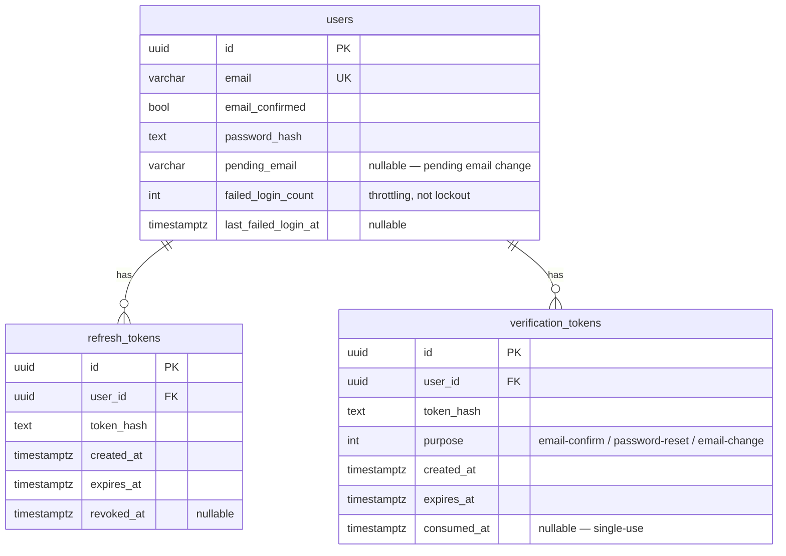
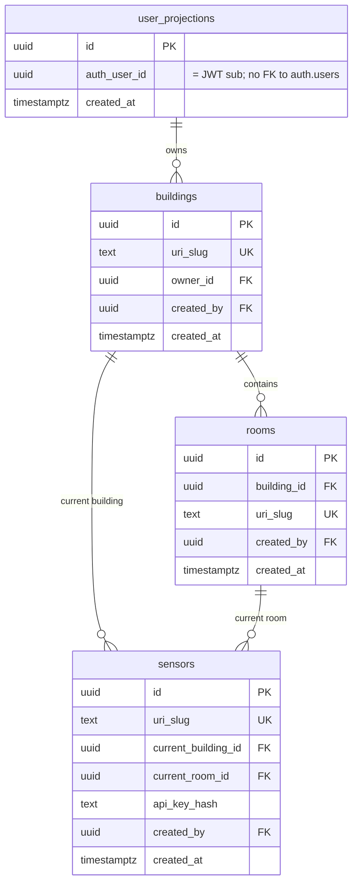
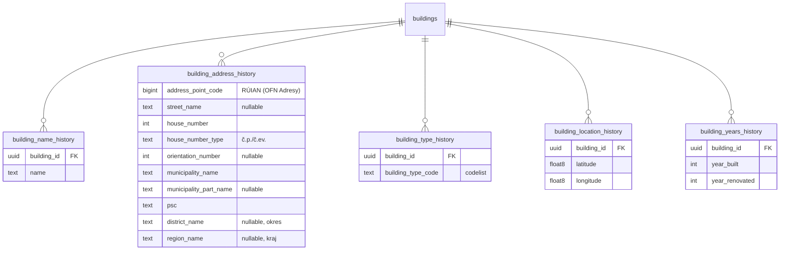
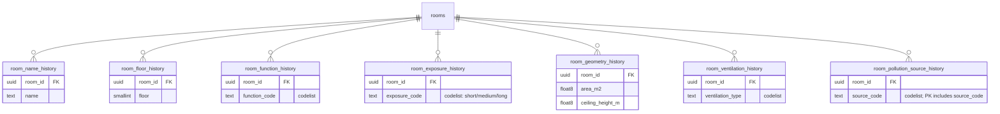
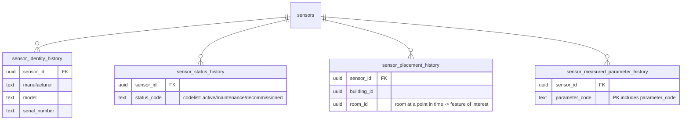
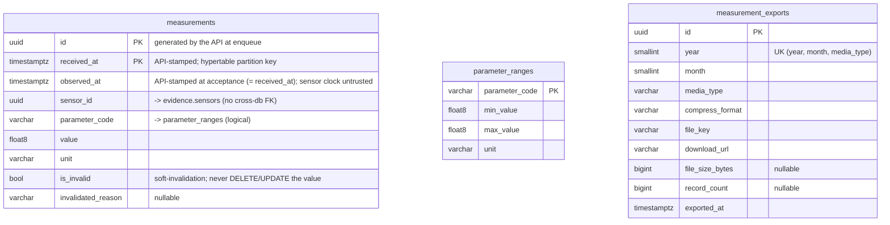

# Entity-relationship diagrams

The three databases (one Postgres instance, three schemas) and how they relate. Diagrams are
[Mermaid](https://mermaid.js.org/) `erDiagram`s rendered by the Git host and derived from the
EF Core models / migrations — **not** scaffolded from a live database.

A deliberate constraint runs through all three: **there are no cross-database foreign keys.**
User identity travels in the JWT `sub` claim (projected into `evidence.user_projections`); a
measurement's `sensor_id` references the evidence catalog logically, with no FK. Dashed notes
below mark these soft boundaries.

---

## `auth` — Auth.Api

Users and their hashed credentials, with refresh and verification tokens as owned collections.

---

## `evidence` — Evidence.Api

Buildings, rooms and sensors are thin aggregate roots; **every attribute is a stream of
temporal history rows**, not a mutable column. Each history row carries a half-open UTC
`tstzrange` **`validity`** plus `recorded_at` / `recorded_by` audit columns, and its primary
key is `(<owner_id>, recorded_at)` (collections add the item code). `btree_gist` exclusion
constraints forbid overlapping validity for the same attribute. To keep the diagrams legible,
the shared `validity` / `recorded_at` / `recorded_by` columns are omitted from the history
entities below and only the payload is shown.

### Aggregate roots

### Building attribute history (PK `(building_id, recorded_at)`)

### Room attribute history (PK `(room_id, recorded_at)`)

### Sensor attribute history (PK `(sensor_id, recorded_at)`)

---

## `ieq` — TimescaleDB (owned by Ingestion.Api migrations)

The `measurements` **hypertable** (partitioned on `received_at`, composite key
`(id, received_at)`), the `parameter_ranges` codelist (18 seeded IEQ parameters), and the
`measurement_exports` log written by Export.Worker.

**Cross-schema soft references (no FK):**

- `ieq.measurements.sensor_id` ⇢ `evidence.sensors.id` — validated by Ingestion.Api against the
  evidence catalog over a read-only connection at acceptance; never enforced by a constraint.
- `ieq.measurements.parameter_code` ⇢ `ieq.parameter_ranges.parameter_code` — same schema, but
  range-checked in application code, not by an FK.
