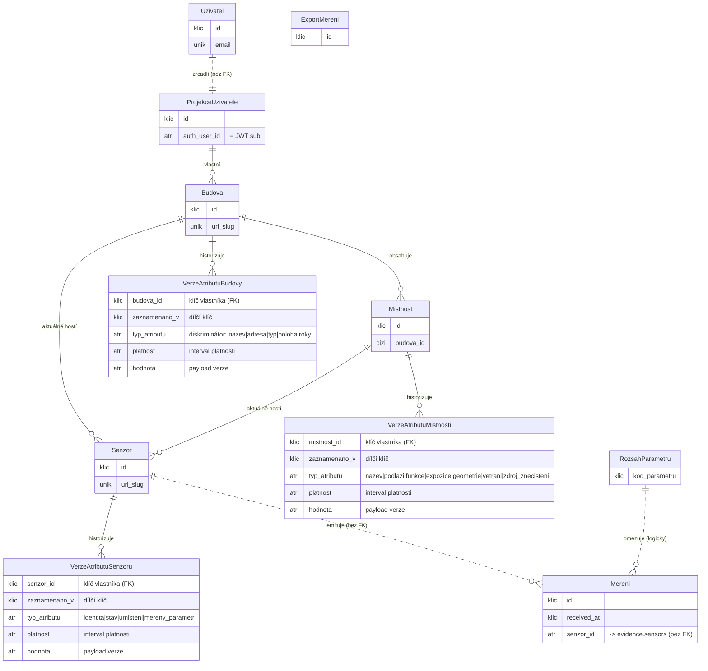
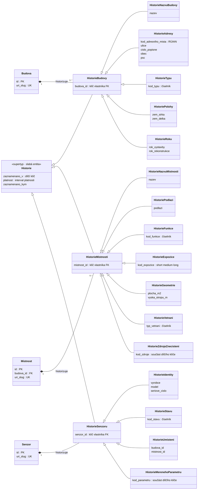

# Konceptuální ER diagram (Chen / crow's foot)

Konceptuální pohled na doménový model napříč třemi databázemi (`auth`, `evidence`, `ieq`).
Zaměřeno na **historizaci entit**: každý atribut budovy, místnosti a senzoru je proud
temporálních verzí, nikoli měnitelný sloupec.

**Notace.** Datové typy jsou v konceptuálním pohledu vynechány; první sloupec značí pouze
**roli atributu** — `klic` (součást primárního klíče), `cizi` (cizí klíč), `unik` (unikátní klíč),
`atr` (běžný atribut). Mermaid odlišuje **identifikační vztah** (plná čára `--`) od
**neidentifikačního / měkkého vztahu** (přerušovaná čára `..`).

- **Silná entita** — má vlastní klíč.
- **Slabá entita** — nemá samostatný klíč; identifikuje ji *klíč vlastníka + dílčí klíč*
  (`zaznamenano_v`, tj. začátek intervalu platnosti). Totální účast, existenčně závislá.
- Historie kolekcí (měřené parametry senzoru, zdroje znečištění místnosti) mají **složený dílčí
  klíč** `(zaznamenano_v, kod_polozky)` — ve stejném čase může platit více položek.

---

## Verze 1 — úplná (slabá entita pro každý atribut)

Věrná fyzickému schématu: každý historizovaný atribut je samostatná slabá entita.

```mermaid
erDiagram
    %% ---------- auth ----------
    Uzivatel ||--o{ ObnovovaciToken : "má"
    Uzivatel ||--o{ OverovaciToken : "má"

    %% ---------- evidence: agregátní kořeny ----------
    ProjekceUzivatele ||--o{ Budova : "vlastní"
    Budova ||--o{ Mistnost : "obsahuje"
    Budova ||--o{ Senzor : "aktuálně hostí"
    Mistnost ||--o{ Senzor : "aktuálně hostí"

    %% ---------- historie budovy (identifikační, slabé) ----------
    Budova ||--o{ HistorieNazvuBudovy : "historizuje"
    Budova ||--o{ HistorieAdresy : "historizuje"
    Budova ||--o{ HistorieTypu : "historizuje"
    Budova ||--o{ HistoriePolohy : "historizuje"
    Budova ||--o{ HistorieRoku : "historizuje"

    %% ---------- historie místnosti ----------
    Mistnost ||--o{ HistorieNazvuMistnosti : "historizuje"
    Mistnost ||--o{ HistoriePodlazi : "historizuje"
    Mistnost ||--o{ HistorieFunkce : "historizuje"
    Mistnost ||--o{ HistorieExpozice : "historizuje"
    Mistnost ||--o{ HistorieGeometrie : "historizuje"
    Mistnost ||--o{ HistorieVetrani : "historizuje"
    Mistnost ||--o{ HistorieZdrojeZnecisteni : "historizuje"

    %% ---------- historie senzoru ----------
    Senzor ||--o{ HistorieIdentity : "historizuje"
    Senzor ||--o{ HistorieStavu : "historizuje"
    Senzor ||--o{ HistorieUmisteni : "historizuje"
    Senzor ||--o{ HistorieMerenehoParametru : "historizuje"

    %% ---------- ieq + měkké mezidatabázové reference (bez FK) ----------
    Uzivatel ||..|| ProjekceUzivatele : "zrcadlí (bez FK)"
    Senzor ||..o{ Mereni : "emituje (bez FK)"
    RozsahParametru ||..o{ Mereni : "omezuje (logicky)"

    Uzivatel {
        klic id
        unik email
    }
    ObnovovaciToken {
        klic uzivatel_id "klíč vlastníka (FK)"
        unik token_hash
    }
    OverovaciToken {
        klic uzivatel_id "klíč vlastníka (FK)"
        unik token_hash
        atr ucel "potvrzení e-mailu / reset hesla / změna e-mailu"
    }

    ProjekceUzivatele {
        klic id
        atr auth_user_id "= JWT sub; bez FK na auth.users"
    }
    Budova {
        klic id
        unik uri_slug
    }
    Mistnost {
        klic id
        cizi budova_id
        unik uri_slug
    }
    Senzor {
        klic id
        unik uri_slug
    }

    HistorieNazvuBudovy {
        klic budova_id "klíč vlastníka (FK)"
        klic zaznamenano_v "dílčí klíč"
        atr nazev
    }
    HistorieAdresy {
        klic budova_id "klíč vlastníka (FK)"
        klic zaznamenano_v "dílčí klíč"
        atr kod_adresniho_mista "RÚIAN (OFN Adresy)"
    }
    HistorieTypu {
        klic budova_id "klíč vlastníka (FK)"
        klic zaznamenano_v "dílčí klíč"
        atr kod_typu "číselník"
    }
    HistoriePolohy {
        klic budova_id "klíč vlastníka (FK)"
        klic zaznamenano_v "dílčí klíč"
        atr zem_sirka
        atr zem_delka
    }
    HistorieRoku {
        klic budova_id "klíč vlastníka (FK)"
        klic zaznamenano_v "dílčí klíč"
        atr rok_vystavby
        atr rok_rekonstrukce
    }

    HistorieNazvuMistnosti {
        klic mistnost_id "klíč vlastníka (FK)"
        klic zaznamenano_v "dílčí klíč"
        atr nazev
    }
    HistoriePodlazi {
        klic mistnost_id "klíč vlastníka (FK)"
        klic zaznamenano_v "dílčí klíč"
        atr podlazi
    }
    HistorieFunkce {
        klic mistnost_id "klíč vlastníka (FK)"
        klic zaznamenano_v "dílčí klíč"
        atr kod_funkce "číselník"
    }
    HistorieExpozice {
        klic mistnost_id "klíč vlastníka (FK)"
        klic zaznamenano_v "dílčí klíč"
        atr kod_expozice "číselník: short/medium/long"
    }
    HistorieGeometrie {
        klic mistnost_id "klíč vlastníka (FK)"
        klic zaznamenano_v "dílčí klíč"
        atr plocha_m2
        atr vyska_stropu_m
    }
    HistorieVetrani {
        klic mistnost_id "klíč vlastníka (FK)"
        klic zaznamenano_v "dílčí klíč"
        atr typ_vetrani "číselník"
    }
    HistorieZdrojeZnecisteni {
        klic mistnost_id "klíč vlastníka (FK)"
        klic zaznamenano_v "dílčí klíč"
        klic kod_zdroje "součást dílčího klíče"
    }

    HistorieIdentity {
        klic senzor_id "klíč vlastníka (FK)"
        klic zaznamenano_v "dílčí klíč"
        atr vyrobce
        atr model
        atr seriove_cislo
    }
    HistorieStavu {
        klic senzor_id "klíč vlastníka (FK)"
        klic zaznamenano_v "dílčí klíč"
        atr kod_stavu "číselník: active/maintenance/decommissioned"
    }
    HistorieUmisteni {
        klic senzor_id "klíč vlastníka (FK)"
        klic zaznamenano_v "dílčí klíč"
        atr budova_id
        atr mistnost_id "místnost v čase -> feature of interest"
    }
    HistorieMerenehoParametru {
        klic senzor_id "klíč vlastníka (FK)"
        klic zaznamenano_v "dílčí klíč"
        klic kod_parametru "součást dílčího klíče"
    }

    Mereni {
        klic id
        klic received_at "oddíl hypertabulky"
        atr senzor_id "-> evidence.sensors (bez FK)"
        atr kod_parametru
        atr hodnota
        atr je_neplatne "měkká invalidace"
    }
    RozsahParametru {
        klic kod_parametru
        atr min_hodnota
        atr max_hodnota
        atr jednotka
    }
    ExportMereni {
        klic id
        atr rok
        atr mesic
        atr typ_media
    }
```

> **Poznámka k tokenům.** `ObnovovaciToken` a `OverovaciToken` jsou existenčně závislé na
> `Uzivatel`, ale nesou globálně unikátní `token_hash` (vlastní přirozený klíč). Zde jsou
> modelovány jako **slabé entity** (bez uživatele nemají význam); alternativně je lze pojmout jako
> silné entity v identifikačním vztahu. Volba je vědomá.

> **Hodnotové objekty.** `Adresa` a `Souřadnice` nejsou entity — jsou to **složené atributy**
> uvnitř historických řádků budovy (zde zploštěné do payloadu).

---

## Verze 2 — generická (vzor temporální verze)

Kompaktní pohled, který zviditelňuje *vzor historizace* místo všech atributů. Každý agregátní
kořen vlastní jednu slabou entitu „verze atributu" s diskriminátorem `typ_atributu` a intervalem
platnosti.

> Generická verze je **modelovací zkratka**, nikoli skutečné fyzické schéma — `typ_atributu` /
> `hodnota` zde zastupují strukturně odlišné tabulky z Verze 1. Pro úplný rozpad atributů viz
> Verzi 1 a fyzické schéma v [`README.md`](README.md).

---

## Verze 3 — generalizace / specializace (EER)

EER zpřesnění Verze 2: namísto diskriminátoru `typ_atributu` zavádíme společný **supertyp
`Historie`** a konkrétní historie jsou jeho **specializace** (vztah ISA, „je typu"). Sdílené
temporální a auditní atributy (`zaznamenano_v` — dílčí klíč, `platnost`, `zaznamenano_kym`) žijí
v supertypu; payload nese každý podtyp. Specializace je **disjunktní a totální** (každý záznam
historie je právě jedna konkrétní historie).

Mezistupeň podle vlastníka (`HistorieBudovy` / `HistorieMistnosti` / `HistorieSenzoru`) drží
**klíč vlastníka** a zachycuje identifikační vlastnictví agregátním kořenem — `Historie` zůstává
**slabou entitou** existenčně závislou na svém kořeni.

> Mermaid `erDiagram` neumí ISA trojúhelník, proto je hierarchie vykreslena jako `classDiagram`,
> kde šipka `<|--` znamená „podtyp je typu nadtypu" a plný kosočtverec `*--` značí existenční
> vlastnictví (kompozici) kořenem.

> **Volitelné rozšíření.** Tři kořeny lze rovněž generalizovat do supertypu `PredmetKatalogu`
> (s `id` a `uri_slug`); `Historie` by pak byla vlastněna jediným abstraktním předmětem evidence.
> Pro přehlednost zde ponecháno na úrovni tří konkrétních kořenů.
